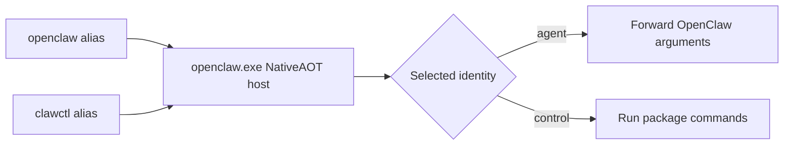
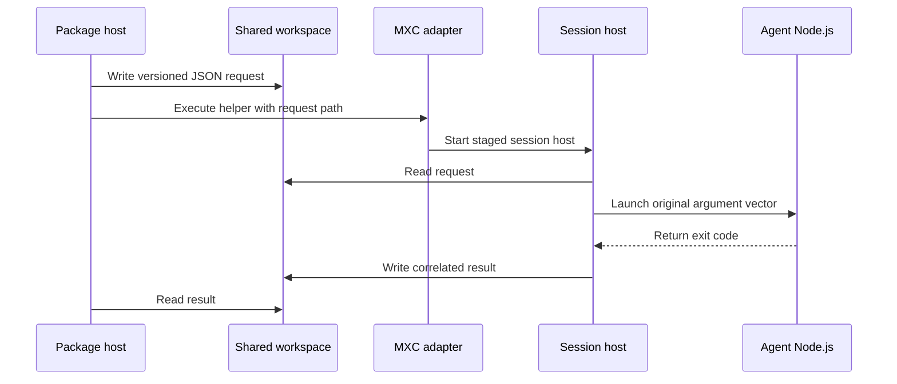
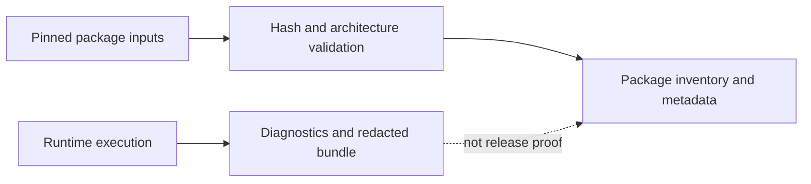

# Architecture

This is an explanation of how the Windows MSIX host is put together for
contributors. It describes the boundaries that preserve a packaged,
NativeAOT-hosted OpenClaw while running the application in an isolated agent
session. It does not own the command catalog or the installed-data inventory:
those remain in the [README command model](../README.md#command-model) and
[installed-data](../README.md#installed-data).

## The host is one binary with two entry points

The package contains one NativeAOT executable, `openclaw.exe`, but exposes it
through two package application identities and aliases: `openclaw` for the
OpenClaw CLI and `clawctl` for package lifecycle and diagnostics. The two
identities are intentional, rather than two copies of a host:

- [`Package.appxmanifest`](../src/OpenClaw.Launcher/Package.appxmanifest)
  binds both application entries and aliases to the same executable.
- [`HostEntrypoint.cs`](../src/OpenClaw.Launcher/HostEntrypoint.cs) selects the
  control identity from the package-qualified application ID when available,
  or from the invoked alias otherwise.
- [`HostStartup.cs`](../src/OpenClaw.Launcher/HostStartup.cs) supplies the
  production collaborators: selected entry point, diagnostic log, package
  base directory, process streams, and installation lifecycle.
- [`Program.cs`](../src/OpenClaw.Launcher/Program.cs) keeps the two surfaces
  separate after startup. The agent surface forwards OpenClaw arguments; the
  control surface owns the package commands.

This arrangement makes the user-facing distinction enforceable by package
activation, while avoiding two launchers that could drift in AOT settings,
diagnostics, or runtime composition. It also protects transparent forwarding:
`openclaw` arguments are OpenClaw-owned and never become `clawctl` options.

## Setup creates an explicit, isolated execution boundary

An ordinary `openclaw` invocation does not provision a session or install a
runtime. It can use only the recorded, usable isolated session created by
explicit setup. Failing instead of provisioning during an application launch
keeps a foreground command from unexpectedly downloading, extracting, or
creating an agent environment, and makes setup state observable and
recoverable.

[`SetupStateStore`](../src/OpenClaw.Launcher/Session/SetupStateStore.cs)
persists the setup phase and its durable outcome. [`SessionRuntime`](../src/OpenClaw.Launcher/Session/SessionRuntime.cs)
composes the shared backend, state stores, helper, and lifecycle lock for both
entry points. [`SessionCoordinator`](../src/OpenClaw.Launcher/Session/SessionCoordinator.cs)
owns the recorded session lifecycle and protects it from concurrent lifecycle
operations. [`SessionExecutor`](../src/OpenClaw.Launcher/Session/SessionExecutor.cs)
turns a validated request into work inside that owned session; setup calls its
runtime installation path explicitly rather than leaving the first gateway or
OpenClaw invocation to do it.

The separation is consequential: state says what this installation recorded,
whereas inspection asks the isolated session what is actually running. A stale
record is therefore not treated as proof that the session is healthy.

## The guest helper carries data, not a user command line

MXC's current execution route accepts a command-line string and flattens it
through `cmd.exe`. Passing the OpenClaw argument vector through that boundary
would allow shell expansion and quoting changes. The
[`OpenClaw.SessionHost`](../src/OpenClaw.SessionHost/Program.cs) helper is the
guest-side adapter: it receives a request-file path, reads the actual request
as JSON, and launches the requested process with the original argument vector.

[`OpenClaw.SessionProtocol`](../src/OpenClaw.SessionProtocol/SessionLaunchProtocol.cs)
defines the AOT-safe JSON contracts shared by host and helper. Each contract
has a schema version and explicit JSON property names; the protocol validates
the expected version and writes a correlated result file. Helper failures are
reported in that result when a request path exists, so the host can distinguish
an operation failure from a transport failure. The one exception is malformed
helper invocation without a request path, which can only report usage on
stderr and exit with the helper failure code.

The helper must be copied before it can run. [`SessionHelperStager`](../src/OpenClaw.Launcher/Session/SessionHelperStager.cs)
stages the immutable packaged helper in the session's shared workspace because
the isolated agent identity cannot execute a binary directly from another
package identity's WindowsApps directory. The shared workspace is visible to
both identities. This is a required execution bridge, not a caching or startup
optimization; staging verifies the packaged source and reports a staging
failure rather than silently substituting another executable.

## Packaging verifies MXC; MXC provides isolation

The boundary with MXC has two responsibilities that should not be conflated:

- Packaging pins and verifies the native runtime. [`mxc-runtime.lock.json`](../mxc-runtime.lock.json)
  records the selected package and integrity information. [`Get-MxcRuntime.ps1`](../scripts/Get-MxcRuntime.ps1)
  obtains that exact archive, verifies registry integrity, and checks the
  allowlisted extracted files' hashes, lengths, and machine architecture.
  [`MxcRuntimeLocator`](../src/OpenClaw.Launcher/Mxc/MxcRuntimeLocator.cs)
  resolves the packaged runtime rather than searching `PATH` or a
  user-writable directory.
- MXC owns the containment implementation. [`MxcCliSessionClient`](../src/OpenClaw.Launcher/Mxc/MxcCliSessionClient.cs)
  is the host adapter to the pinned executor, while
  [`MxcWireProtocol`](../src/OpenClaw.Launcher/Mxc/MxcWireProtocol.cs)
  confines the versioned preview request and response envelopes to one place.
  Its isolation-session wire schema is independently versioned from the npm
  package pin.

The result is a narrow trust boundary: this repository decides exactly which
runtime is packaged and verifies it, but does not reimplement MXC's process
and session isolation semantics.

## Node belongs to the agent account

The Node archive is package content, but [`SessionRuntimeInstaller`](../src/OpenClaw.SessionHost/SessionRuntimeInstaller.cs)
runs inside the isolated agent and extracts Node into that account's profile,
not the package host's LocalState. The two identities do not share readable
per-account package state. Extraction by the account that will execute Node
also gives that account ownership of the extracted files.

The installer version-checks the extracted runtime and can prepend its runtime
directory to the agent user's `PATH`. Launch requests also carry a
process-specific path prefix, so Node is discoverable by the intended guest
process without changing the host process's `PATH` or depending on an
arbitrary machine-wide Node installation.

## Gateway lifecycle is recorded, observed, and restarted at logon

The gateway is an optional background process inside the same recorded agent
session. [`GatewayController`](../src/OpenClaw.Launcher/Gateway/GatewayController.cs)
coordinates its start, stop, and health inspection; it does not infer liveness
from a persisted record. [`GatewayConfigurationStore`](../src/OpenClaw.Launcher/Gateway/GatewayConfigurationStore.cs)
persists launch choices because the later logon task has no interactive caller
from which to recover them. [`SchTasksGatewayScheduler`](../src/OpenClaw.Launcher/Gateway/SchTasksGatewayScheduler.cs)
uses the inbox `schtasks.exe` and a task registered for the signed-in user's
logon, avoiding NativeAOT-incompatible Task Scheduler COM interop and avoiding
elevation that would make the task user-unmanageable.

The real control command is `gateway-service`, not `gateway`. The configured
port is distinct from the upstream default. The launcher does not force the
default into the child command line, and status never uses it as a fallback
address: only a configured or observed listener can be reported. This lets
OpenClaw resolve its own configuration and prevents a packaging-side default
from overriding upstream behavior or sending a user to a port that was never
observed.

`gateway-service restart` performs the existing stop and start operations
under one lifecycle lock. A missing or already-exited gateway makes the stop a
no-op and the start continues. If the gateway cannot be confirmed stopped, the
operation retains its ownership record and does not launch a replacement.

## Diagnostics and build inputs have different trust roles

[`HostDiagnosticLog`](../src/OpenClaw.Launcher/HostDiagnosticLog.cs) writes
host diagnostics beneath packaged LocalState when packaged, or the documented
per-user fallback otherwise. A named mutex keyed by the log path keeps
concurrent writers from interleaving records.

[`DiagnosticsBundle`](../src/OpenClaw.Launcher/Gateway/DiagnosticsBundle.cs)
collects troubleshooting material through the shared workspace while excluding
credential stores. [`DiagnosticsRedactor`](../src/OpenClaw.Launcher/Gateway/DiagnosticsRedactor.cs)
redacts credential-shaped JSON members in remaining text, but that redaction
is deliberately best-effort and does not make a bundle safe to share without
review.

Diagnostics describe runtime evidence; they are not release verification.
The build path independently creates an inventory of package inputs and hashes
their content in [`Build-MSIX.ps1`](../scripts/Build-MSIX.ps1). That inventory,
the pinned MXC archive checks, and packaging metadata form the release trust
boundary: a successful process launch alone is not evidence that the intended
payload was packaged.

## End-to-end flow

1. Windows activates an alias; the one NativeAOT host identifies the agent or
   control application identity.
2. `clawctl setup` explicitly creates or repairs the isolated session,
   stages the helper, and installs the agent-owned Node runtime.
3. `openclaw` loads the recorded session and sends a JSON launch request to
   the staged helper through the MXC adapter; it never provisions implicitly.
4. The helper replays the argument vector inside the agent session with the
   agent runtime first on that child process's path.
5. If configured, `gateway-service` records its launch configuration and the
   logon task restarts the gateway through the same session boundary.

## Source map

| Concept | Authoritative tracked files |
| --- | --- |
| Package applications, aliases, and launcher dispatch | [`Package.appxmanifest`](../src/OpenClaw.Launcher/Package.appxmanifest), [`HostEntrypoint.cs`](../src/OpenClaw.Launcher/HostEntrypoint.cs), [`HostStartup.cs`](../src/OpenClaw.Launcher/HostStartup.cs), [`Program.cs`](../src/OpenClaw.Launcher/Program.cs) |
| Setup state and session lifecycle | [`SetupStateStore.cs`](../src/OpenClaw.Launcher/Session/SetupStateStore.cs), [`SessionRuntime.cs`](../src/OpenClaw.Launcher/Session/SessionRuntime.cs), [`SessionCoordinator.cs`](../src/OpenClaw.Launcher/Session/SessionCoordinator.cs), [`SessionExecutor.cs`](../src/OpenClaw.Launcher/Session/SessionExecutor.cs) |
| Guest protocol and helper staging | [`OpenClaw.SessionHost/Program.cs`](../src/OpenClaw.SessionHost/Program.cs), [`SessionLaunchProtocol.cs`](../src/OpenClaw.SessionProtocol/SessionLaunchProtocol.cs), [`SessionHelperStager.cs`](../src/OpenClaw.Launcher/Session/SessionHelperStager.cs) |
| MXC runtime and wire boundary | [`mxc-runtime.lock.json`](../mxc-runtime.lock.json), [`Get-MxcRuntime.ps1`](../scripts/Get-MxcRuntime.ps1), [`MxcRuntimeLocator.cs`](../src/OpenClaw.Launcher/Mxc/MxcRuntimeLocator.cs), [`MxcCliSessionClient.cs`](../src/OpenClaw.Launcher/Mxc/MxcCliSessionClient.cs), [`MxcWireProtocol.cs`](../src/OpenClaw.Launcher/Mxc/MxcWireProtocol.cs) |
| Agent runtime installation | [`SessionRuntimeInstaller.cs`](../src/OpenClaw.SessionHost/SessionRuntimeInstaller.cs) |
| Gateway lifecycle | [`SchTasksGatewayScheduler.cs`](../src/OpenClaw.Launcher/Gateway/SchTasksGatewayScheduler.cs), [`GatewayController.cs`](../src/OpenClaw.Launcher/Gateway/GatewayController.cs), [`GatewayConfigurationStore.cs`](../src/OpenClaw.Launcher/Gateway/GatewayConfigurationStore.cs) |
| Diagnostics and payload integrity | [`HostDiagnosticLog.cs`](../src/OpenClaw.Launcher/HostDiagnosticLog.cs), [`DiagnosticsBundle.cs`](../src/OpenClaw.Launcher/Gateway/DiagnosticsBundle.cs), [`DiagnosticsRedactor.cs`](../src/OpenClaw.Launcher/Gateway/DiagnosticsRedactor.cs), [`Build-MSIX.ps1`](../scripts/Build-MSIX.ps1) |
